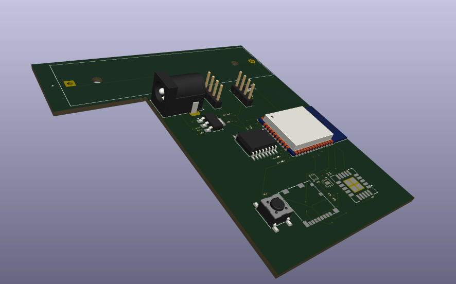

# BlackBox — Room Health / Environmental Monitoring PCB

Custom KiCad PCB for a battery-powered, ESP32-class device intended to monitor room/environment conditions and log data locally.

## Design previews

### 3D view

### PCB layout

### Schematic

## Project overview
BlackBox is a hardware design project focused on a practical embedded system that combines sensing, local storage, battery operation, and an ESP32-class MCU. The goal is a compact “room health” monitoring unit that can collect measurements and store them for later analysis.

## Intended system (high-level)
- MCU / Wireless: ESP32-class microcontroller (e.g., ESP32-S3)
- Sensors: LDR (ambient light), ultrasonic (distance/proximity), plus analog sensor input(s)
- Analog front-end: LMV321 op-amp stage for signal conditioning/amplification
- Storage: micro-SD card for local data logging
- Power: battery input (VBAT) with 3.3 V regulation and battery management/protection

## Repository contents
- KiCad project: `.kicad_pro`
- Schematic: `.kicad_sch`
- PCB layout: `.kicad_pcb`
- 3D model export: `.step` (if included)
- Documentation images: `docs/pcb_3d.png`, `docs/pcb_layout.png`, `docs/schematic.png`

## How to open and review
1. Install KiCad (v7+ recommended).
2. Open the `.kicad_pro` file.
3. Review the schematic (`.kicad_sch`) and PCB layout (`.kicad_pcb`).
4. Run ERC (schematic checks) and DRC (PCB checks) inside KiCad.

## Status
- Schematic and PCB layout created
- Next: final DRC/ERC pass and documentation polish
- Next: order PCB and bring-up tests (power rails, SD, sensor IO)
- Next: firmware (sampling + logging format) and enclosure design

## Skills demonstrated
- End-to-end PCB design workflow in KiCad (schematic capture, layout, manufacturable design)
- Embedded hardware system design (power, sensing, analog conditioning, storage interfaces)
- Clear engineering documentation for review (renders + structured project summary)

## License
If no license file is included, all rights reserved (portfolio viewing only).
